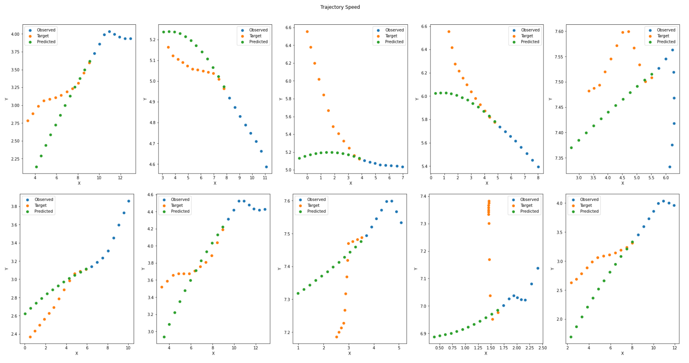

# Human Trajectory Forecasting

This Repository refers to the [[Third Homework](https://github.com/FraLuca/TF4AML)] of the course Advanced Machine Learning (AML) at University Sapienza of Rome 2022/2023.

## Group members:
* Alessandro Sottile
* Giacomo Scarponi
* Francesco Sciarra
* Carolina Romani 

The notebook provides an introduction to Transformer Network (TF).

The aim of this homework is to guide students through an implementation of the architecture studied in class.
